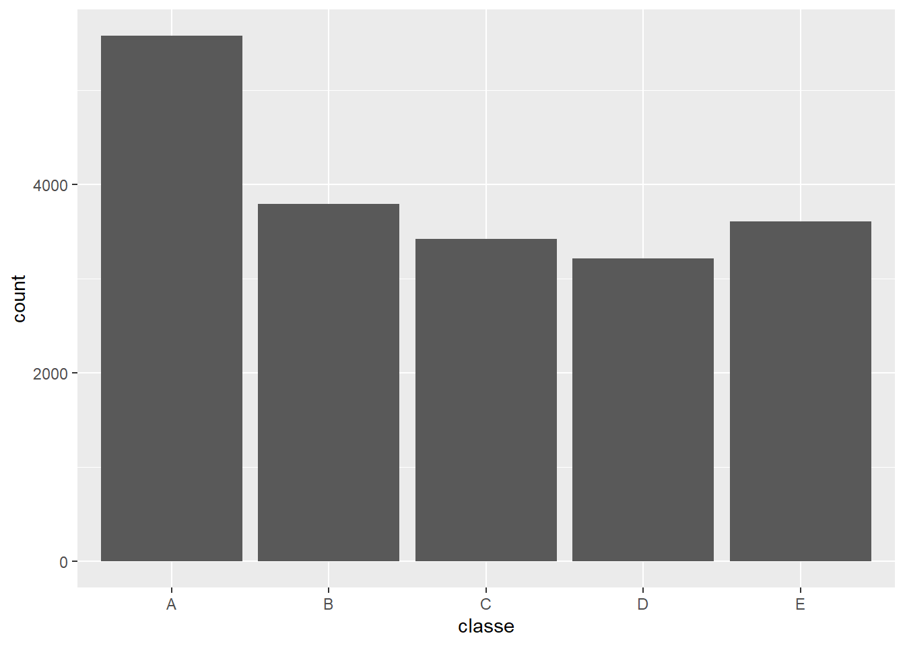
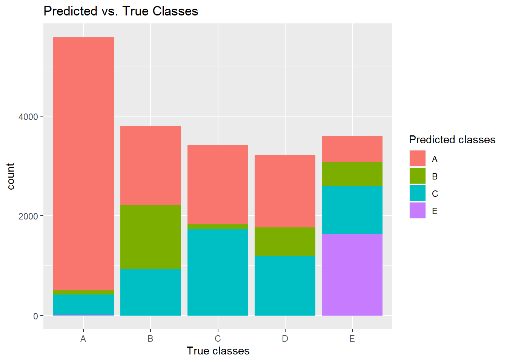
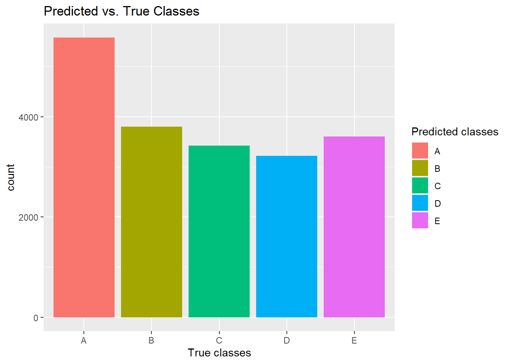
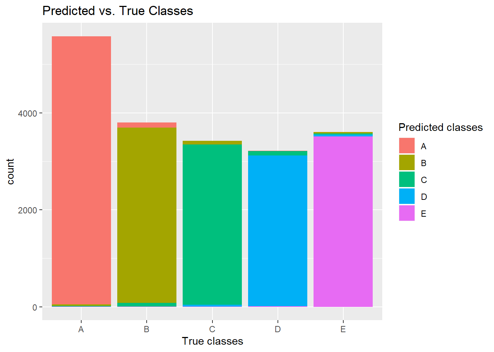

# Executive Summary

This report analyses the data from accelerometers on the belt, forearm, arm, and dumbell of 6 participants collected.
Several models are trained (decision tree, random forest, gradient boosting machine) to predict the classe variable in the data. For more information about the data see [here](http://web.archive.org/web/20161224072740/http:/groupware.les.inf.puc-rio.br/har).
The random forest model has the best prediction accuracy and therefore is used to predict classe value in the testing data.

# Load Data

```r
library(caret)
library(ggplot2)
trainUrl <- "https://d396qusza40orc.cloudfront.net/predmachlearn/pml-training.csv"
download.file(trainUrl, destfile = "data/pml-training.csv", )
testUrl <-"https://d396qusza40orc.cloudfront.net/predmachlearn/pml-testing.csv"
download.file(testUrl, destfile = "data/pml-testing.csv")
training <- read.csv("data/pml-training.csv", stringsAsFactors = FALSE)
testing <- read.csv("data/pml-testing.csv", stringsAsFactors = FALSE)
```


# Distribution of Output

```r
ggplot(training, aes(classe)) + geom_bar()
```

<!-- -->

# Convert Data to numeric values

```r
# convert to numeric
training[,-c(1:7,160)] <- lapply(training[,-c(1:7,160)], as.numeric)
```

# Clean Data
Remove variables, that contain to much NA values (> 95%).

```r
# check for NAs
countNAs <- sort(sapply(training, function(x) sum(is.na(x))/length(x)), decreasing = TRUE)
# use only columnt with less than 95% NAs
training <- training[,names(countNAs[countNAs < 0.95])]
```

# Filter Columns
Keep only numeric data from movement sensors and the output variable.

```r
training <- training[,-c(1:7)]
```

# Cross validation
Use k-fold cross validation to improve model performance.

```r
fitControl <- trainControl(method = "cv",
                           number = 5)
```

# Model Training
Train first model based on a decision tree (rpart).

```r
timeRpart <- system.time({
    modelRpart <- train(classe ~., data = training, method = "rpart", trControl = fitControl)
})
```

```r
pred <- predict(modelRpart, training)
confM <- confusionMatrix(data = pred, reference = factor(training$classe))
confM
```

```
## Confusion Matrix and Statistics
## 
##           Reference
## Prediction    A    B    C    D    E
##          A 5080 1581 1587 1449  524
##          B   81 1286  108  568  486
##          C  405  930 1727 1199  966
##          D    0    0    0    0    0
##          E   14    0    0    0 1631
## 
## Overall Statistics
##                                           
##                Accuracy : 0.4956          
##                  95% CI : (0.4885, 0.5026)
##     No Information Rate : 0.2844          
##     P-Value [Acc > NIR] : < 2.2e-16       
##                                           
##                   Kappa : 0.3407          
##                                           
##  Mcnemar's Test P-Value : NA              
## 
## Statistics by Class:
## 
##                      Class: A Class: B Class: C Class: D Class: E
## Sensitivity            0.9104  0.33869  0.50468   0.0000  0.45218
## Specificity            0.6339  0.92145  0.78395   1.0000  0.99913
## Pos Pred Value         0.4970  0.50850  0.33040      NaN  0.99149
## Neg Pred Value         0.9468  0.85310  0.88225   0.8361  0.89008
## Prevalence             0.2844  0.19351  0.17440   0.1639  0.18382
## Detection Rate         0.2589  0.06554  0.08801   0.0000  0.08312
## Detection Prevalence   0.5209  0.12889  0.26638   0.0000  0.08383
## Balanced Accuracy      0.7721  0.63007  0.64431   0.5000  0.72565
```

The model has a bad accuracy of only 50% on the training data. It took 5.69s to calculate the model.
Compare predicted and true classes.

```r
ggplot(training, aes(x = classe, fill = pred)) + geom_bar() + labs(x = "True classes", fill = "Predicted classes", title = "Predicted vs. True Classes")
```

<!-- -->


Train another model based on random forest (rf).

```r
timeRf <- system.time({
    modelRf <- train(classe ~., data = training, method = "rf", trControl = fitControl)
})
```


```r
pred <- predict(modelRf, training)
confM <- confusionMatrix(data = pred, reference = factor(training$classe))
confM
```

```
## Confusion Matrix and Statistics
## 
##           Reference
## Prediction    A    B    C    D    E
##          A 5580    0    0    0    0
##          B    0 3797    0    0    0
##          C    0    0 3422    0    0
##          D    0    0    0 3216    0
##          E    0    0    0    0 3607
## 
## Overall Statistics
##                                      
##                Accuracy : 1          
##                  95% CI : (0.9998, 1)
##     No Information Rate : 0.2844     
##     P-Value [Acc > NIR] : < 2.2e-16  
##                                      
##                   Kappa : 1          
##                                      
##  Mcnemar's Test P-Value : NA         
## 
## Statistics by Class:
## 
##                      Class: A Class: B Class: C Class: D Class: E
## Sensitivity            1.0000   1.0000   1.0000   1.0000   1.0000
## Specificity            1.0000   1.0000   1.0000   1.0000   1.0000
## Pos Pred Value         1.0000   1.0000   1.0000   1.0000   1.0000
## Neg Pred Value         1.0000   1.0000   1.0000   1.0000   1.0000
## Prevalence             0.2844   0.1935   0.1744   0.1639   0.1838
## Detection Rate         0.2844   0.1935   0.1744   0.1639   0.1838
## Detection Prevalence   0.2844   0.1935   0.1744   0.1639   0.1838
## Balanced Accuracy      1.0000   1.0000   1.0000   1.0000   1.0000
```

The model has a better accuracy of 100% on the training data. It took 541.03s to calculate the model.
Compare predicted and true classes.

```r
ggplot(training, aes(x = classe, fill = pred)) + geom_bar() + labs(x = "True classes", fill = "Predicted classes", title = "Predicted vs. True Classes")
```

<!-- -->

Train another model based on a gradient boosting machine (gbm).

```r
timeGbm <- system.time({
    modelGbm <- train(classe ~., data = training, method = "gbm", trControl = fitControl, verbose = FALSE)
})
```


```r
pred <- predict(modelGbm, training)
confM <- confusionMatrix(data = pred, reference = factor(training$classe))
confM
```

```
## Confusion Matrix and Statistics
## 
##           Reference
## Prediction    A    B    C    D    E
##          A 5519   84    0    1    4
##          B   42 3635   77    9   24
##          C   14   75 3308   86   22
##          D    4    3   31 3103   34
##          E    1    0    6   17 3523
## 
## Overall Statistics
##                                          
##                Accuracy : 0.9728         
##                  95% CI : (0.9704, 0.975)
##     No Information Rate : 0.2844         
##     P-Value [Acc > NIR] : < 2.2e-16      
##                                          
##                   Kappa : 0.9656         
##                                          
##  Mcnemar's Test P-Value : < 2.2e-16      
## 
## Statistics by Class:
## 
##                      Class: A Class: B Class: C Class: D Class: E
## Sensitivity            0.9891   0.9573   0.9667   0.9649   0.9767
## Specificity            0.9937   0.9904   0.9878   0.9956   0.9985
## Pos Pred Value         0.9841   0.9599   0.9438   0.9773   0.9932
## Neg Pred Value         0.9956   0.9898   0.9929   0.9931   0.9948
## Prevalence             0.2844   0.1935   0.1744   0.1639   0.1838
## Detection Rate         0.2813   0.1853   0.1686   0.1581   0.1795
## Detection Prevalence   0.2858   0.1930   0.1786   0.1618   0.1808
## Balanced Accuracy      0.9914   0.9739   0.9773   0.9802   0.9876
```

The model has an accuracy of 97% on the training data. This is almost as good, as the accuracy of the random forest model. It took 277.8s to calculate the model.
Compare predicted and true classes.

```r
ggplot(training, aes(x = classe, fill = pred)) + geom_bar() + labs(x = "True classes", fill = "Predicted classes", title = "Predicted vs. True Classes")
```

<!-- -->

# Model Decision
The random forest model had the best accuracy on the training data, so this model will be chosen to calculate the predictions for the test data.


# Expected Out of Sample Error
The shown accuracy was calculated on the training data. We expect a worse accuracy on the testing data, because this data was unseen in the training of the model.

# Predict Testing Data
Predict outcome in testing data with the random forest model

```r
pred <- predict(modelRf, testing)
pred
```

```
##  [1] B A B A A E D B A A B C B A E E A B B B
## Levels: A B C D E
```

